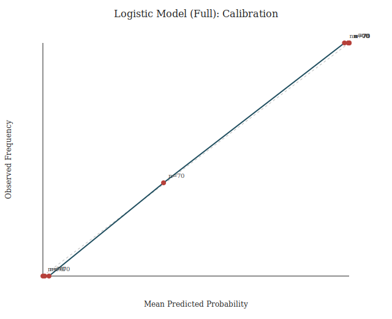

# Academic Impact (Affects_Academic_Performance) — Results Report

This report follows the workflow in `reports/academic_impact_question_plan.md` and summarizes the results produced by `scripts/academic_impact_analysis.py`.

## Question
Which factors best explain whether a student reports that social media affects their academic performance (Yes/No), and how large are those effects?

## Hypotheses (research / directional)
We test whether the data supports the following directional hypotheses (associational, not causal):
- H1: Higher `Avg_Daily_Usage_Hours` and higher `Addicted_Score` are associated with higher probability of reporting academic impact (Yes).
- H2: Lower `Sleep_Hours_Per_Night` and lower `Mental_Health_Score` are associated with higher probability of reporting academic impact (Yes).
- H3: Higher `Conflicts_Over_Social_Media` is associated with higher probability of reporting academic impact (Yes).
- H4: `Most_Used_Platform` and `Relationship_Status` are not independent of academic impact (association exists).
- H5: `Gender` has weak or no association with academic impact.

## Step 1 — Descriptives + CI (proportion)
- Rows analyzed: 705
- Academic impact: Yes=453 (0.643), No=252 (0.357)
- 95% CI for proportion Yes (Wilson): [0.606, 0.677]

### Figure: average outcomes by academic impact group

- Visual takeaway: the `Yes` group has higher usage/addiction/conflicts and lower sleep/mental health on average.

## Step 2 — Numeric comparisons (Yes vs No): mean differences + effect sizes
Table shows mean(Yes) − mean(No), a 95% CI for that difference, and Cohen’s d (magnitude of difference in SD units).

| Variable | Mean Yes | Mean No | Diff (Yes−No) | 95% CI | Cohen’s d |
|---|---:|---:|---:|---:|---:|
| Avg_Daily_Usage_Hours | 5.54 | 3.80 | 1.73 | [1.60, 1.87] | 1.84 |
| Addicted_Score | 7.46 | 4.60 | 2.87 | [2.75, 2.98] | 3.61 |
| Conflicts_Over_Social_Media | 3.44 | 1.78 | 1.66 | [1.59, 1.74] | 3.13 |
| Mental_Health_Score | 5.56 | 7.42 | -1.86 | [-1.95, -1.77] | -2.87 |
| Sleep_Hours_Per_Night | 6.34 | 7.81 | -1.47 | [-1.59, -1.35] | -1.67 |
| Age | 20.52 | 20.92 | -0.40 | [-0.62, -0.18] | -0.29 |

Full table: `results/academic_impact/numeric_group_comparisons.csv`.

## Step 3 — Categorical associations (chi-square + Cramér’s V)
Platforms are automatically grouped as “top K” (default K=6) + `Other` to reduce sparsity.

| Variable | p-value | Cramér’s V | Min expected count |
|---|---:|---:|---:|
| Gender | 0.5113 | 0.025 | 125.82 |
| Academic_Level | 0.0045 | 0.124 | 9.65 |
| Relationship_Status | <1e-4 | 0.179 | 11.44 |
| Most_Used_Platform | <1e-4 | 0.545 | 7.51 |

Full summary: `results/academic_impact/categorical_chi_square_summary.csv`.

## Hypothesis testing technique (what we do in this report)
Your hypotheses (H1–H5) are *research statements* (in words). To test them, we translate them into a **null hypothesis H0** (no effect) and a **statistical alternative H1** (effect / direction), then use a test statistic + a decision rule.

General template:
- 1) Define H0 and H1 (and the outcome coding).
- 2) Choose significance level α (here α=0.05).
- 3) Compute a test statistic and compare to a critical value (or p-value).
- 4) Decision: **reject H0** or **fail to reject H0**.
- 5) Report an effect size (magnitude), not only significance.

How that maps to our steps:
- **Numeric predictors (Step 2 / Section B):** we test H0: μ_yes = μ_no for each numeric variable.
  - Test statistic (large-sample z; close to a Welch two-sample t-test when n is large):
    - `z = (x̄_yes − x̄_no) / sqrt(s_yes²/n_yes + s_no²/n_no)`
  - Two-sided decision at α=0.05: reject if `|z| ≥ 1.96` (equivalently: the 95% CI for `x̄_yes − x̄_no` does not include 0).
  - Effect size: **Cohen’s d** (difference in SD units).
- **Categorical predictors (Step 3 / Section A):** we test H0: variable ⟂ academic impact (independence) using chi-square.
  - Test statistic: `χ² = Σ (O − E)² / E`, df = `(r−1)(c−1)`; reject if `χ² ≥ χ²(0.95, df)`.
  - Effect size: **Cramér’s V** (0 = none, larger = stronger association).
- **Logistic regression (Step 4):** we test H0: β=0 (equivalently OR=1) for each predictor, but here we treat ORs as descriptive because the data is (near-)separable (very wide CIs).
  - Outcome is coded `Yes=1` (reporting academic impact), so **OR>1 increases odds of reporting impact**; **OR<1 decreases odds** (protective direction).
  - Numeric predictors are standardized (z-scored), so “+1 unit” = **+1 SD** in that variable.

Important wording note: “supported” in the interpretation below means “evidence is consistent with the research hypothesis”. Formally we only make decisions about H0 (reject / fail to reject).

## Hypothesis tests (explicit critical-value decisions, α=0.05)
This section writes each test in the “H0 / test statistic / critical value / decision” format.

### A) Categorical vs academic impact (chi-square independence)
For each variable: H0 = independence between the variable and `Affects_Academic_Performance`.

| Variable | H0 | Test stat χ² | df | Critical χ²(0.95) | Decision |
|---|---|---:|---:|---:|---|
| Gender | independence | 0.43 | 1 | 3.84 | Fail to reject H0 |
| Academic_Level | independence | 10.79 | 2 | 5.99 | Reject H0 |
| Relationship_Status | independence | 22.71 | 2 | 5.99 | Reject H0 |
| Most_Used_Platform | independence | 209.43 | 6 | 12.59 | Reject H0 |

Note: chi-square is an approximation; interpret cautiously when expected counts are small (see `min_expected`).

### B) Numeric vs academic impact (two-sample z approximation)
For each variable: H0 = mean(Yes) = mean(No); two-sided at α=0.05, so reject if |z| ≥ 1.96.

| Variable | H0 | z | Critical | Decision |
|---|---|---:|---:|---|
| Avg_Daily_Usage_Hours | μ_yes = μ_no | 25.39 | ±1.96 | Reject H0 |
| Addicted_Score | μ_yes = μ_no | 47.81 | ±1.96 | Reject H0 |
| Conflicts_Over_Social_Media | μ_yes = μ_no | 42.51 | ±1.96 | Reject H0 |
| Mental_Health_Score | μ_yes = μ_no | -40.24 | ±1.96 | Reject H0 |
| Sleep_Hours_Per_Night | μ_yes = μ_no | -23.34 | ±1.96 | Reject H0 |
| Age | μ_yes = μ_no | -3.59 | ±1.96 | Reject H0 |

Note: this uses a normal approximation; it’s close to a two-sample t-test when group sizes are large.

### Interpretation (link back to the research hypotheses)
Mapping the formal H0 decisions above to H1–H5 (direction checked using the observed mean differences):

- H1 (higher usage/addiction → more impact):
  - `Avg_Daily_Usage_Hours`: Supported (reject H0, expected direction)
  - `Addicted_Score`: Supported (reject H0, expected direction)
- H2 (lower sleep/mental health → more impact):
  - `Sleep_Hours_Per_Night`: Supported (reject H0, expected direction)
  - `Mental_Health_Score`: Supported (reject H0, expected direction)
- H3 (higher conflicts → more impact):
  - `Conflicts_Over_Social_Media`: Supported (reject H0, expected direction)
- H4 (platform + relationship status associated with impact):
  - `Most_Used_Platform`: Supported (reject H0)
  - `Relationship_Status`: Supported (reject H0)
- H5 (gender weak/no association):
  - `Gender`: Consistent (fail to reject H0 of independence).

## Step 4 — Logistic regression (multivariable explanation)
The dataset shows perfect classification in these models (AUC≈1, Acc≈1), which is a sign of (near-)complete separation; treat odds ratios as descriptive and prioritize effect sizes + robustness.

For interpretability, the table below uses the ridge-regularized run (`--l2 1.0`) to avoid extreme/infinite odds ratios.

| Predictor (standardized numeric) | Odds ratio | 95% CI |
|---|---:|---:|
| Conflicts_Over_Social_Media | 50.41 | [6.76, 375.72] |
| Addicted_Score | 12.72 | [0.72, 223.67] |
| Avg_Daily_Usage_Hours | 1.41 | [0.16, 12.68] |
| Mental_Health_Score | 0.23 | [0.01, 4.35] |
| Sleep_Hours_Per_Night | 0.73 | [0.12, 4.51] |
| Age | 0.79 | [0.15, 4.24] |

Full coefficient table: `results/academic_impact_ridge/logistic_full_odds_ratios.csv`.

### Figure: strongest effects (ridge logistic model)

- Read: red dot = odds ratio (OR), blue line = 95% CI, dashed line at OR=1 = “no association”.
- In this dataset, `Conflicts_Over_Social_Media` has the largest OR (strongest positive association with reporting academic impact).
- Many CIs are wide and some cross OR=1, so those effects are uncertain in the multivariable model.

### Figure: ROC curve (ridge logistic model)

- AUC≈1 means the model separates Yes vs No almost perfectly in this dataset.
- This is a warning sign for (near-)complete separation/synthetic structure; treat logistic inference as descriptive.

### Figure: calibration (ridge logistic model)

- Points near the diagonal indicate predicted probabilities match observed frequencies within bins.
- Here most bins sit near (0,0) or (1,1): the model outputs very extreme probabilities for most rows (again consistent with separation).

## Step 5 — Robustness / sensitivity (exclude High School)
High School is a small subgroup (n=27 in the full dataset). We rerun the key analyses excluding High School to check sensitivity.

### Numeric effects: very stable without High School
| Variable | Diff all | Diff excl. HS | Cohen’s d all | Cohen’s d excl. HS |
|---|---:|---:|---:|---:|
| Avg_Daily_Usage_Hours | 1.73 | 1.72 | 1.84 | 1.80 |
| Addicted_Score | 2.87 | 2.82 | 3.61 | 3.58 |
| Conflicts_Over_Social_Media | 1.66 | 1.63 | 3.13 | 3.07 |
| Mental_Health_Score | -1.86 | -1.83 | -2.87 | -2.82 |
| Sleep_Hours_Per_Night | -1.47 | -1.42 | -1.67 | -1.63 |
| Age | -0.40 | -0.31 | -0.29 | -0.23 |

### Categorical: Academic level association is driven by the High School group
| Variable | p all | V all | p excl. HS | V excl. HS |
|---|---:|---:|---:|---:|
| Academic_Level | 0.0045 | 0.124 | 0.3262 | 0.038 |
| Relationship_Status | <1e-4 | 0.179 | <1e-4 | 0.179 |
| Most_Used_Platform | <1e-4 | 0.545 | <1e-4 | 0.552 |
| Gender | 0.5113 | 0.025 | 0.6753 | 0.016 |

Ridge logistic effects are also similar after excluding High School (see `results/academic_impact_ridge_no_hs/logistic_full_odds_ratios.csv`).

## Conclusion (answer to the question)
- Students reporting academic impact have much higher usage, addiction, and relationship-conflict scores, and lower sleep and mental health scores; effect sizes are very large in this dataset.
- Platform and relationship status are strongly associated with academic impact (largest categorical effect: platform grouping), while gender is not.
- Results are not driven by the small High School subgroup for the main numeric relationships; however, the academic-level association largely comes from High School vs the other levels.

## Limitations
- Cross-sectional, self-reported survey variables; interpret as associations, not causation.
- Perfect classification suggests the dataset may be synthetic/structured; logistic-regression inference can be unstable under separation.

## Technical walkthrough
- Step-by-step explanation: `reports/academic_impact_technical_report.md`
