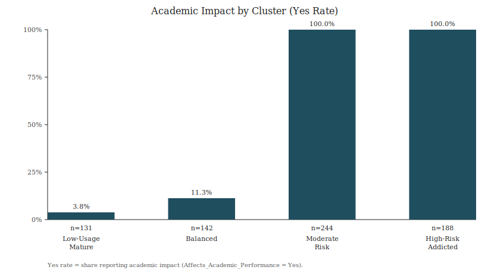

# Academic Impact by Cluster (k=4)

This summary connects the 4 K-Means clusters (based on numeric behavior metrics) to
academic impact (`Affects_Academic_Performance = Yes/No`) as a post-hoc outcome.

## Cluster impact table
| Cluster | n | Yes | Yes rate |
|---|---:|---:|---:|
| Low-Usage Mature Users | 131 | 5 | 3.8% |
| Balanced Users | 142 | 16 | 11.3% |
| Moderate-Risk Users | 244 | 244 | 100.0% |
| High-Risk Addicted Users | 188 | 188 | 100.0% |

Data: `reports/cluster_academic_impact_summary.csv`

## Figure

## Interpretation (short)
- Academic impact is nearly absent in the two low-risk clusters.
- Both moderate and high-risk clusters show universal academic impact.
- This separation explains why the logistic model can achieve AUC near 1.0.
