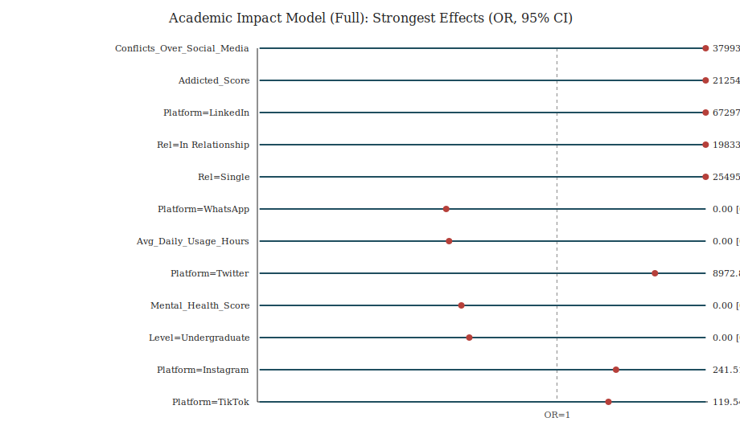

# Academic Impact Analysis (CI, Chi-square, Logistic Regression)

## Sample
- Rows analyzed: 678
- Academic impact: Yes=428 (0.631), No=250 (0.369)
- 95% CI for proportion Yes (Wilson): [0.594, 0.667]
- Note: excluded `Academic_Level = High School`.

## Numeric comparisons (Yes vs No)
Outputs: `numeric_group_comparisons.csv` (mean difference CI + Cohen’s d).

## Categorical associations (chi-square independence tests)
Summary: `categorical_chi_square_summary.csv` (includes Cramér’s V).

### Gender
- Chi-square=0.18, df=1, p=0.6753, Cramér’s V=0.016, min expected=124.63

### Academic_Level
- Chi-square=0.96, df=1, p=0.3262, Cramér’s V=0.038, min expected=119.84

### Relationship_Status
- Chi-square=21.67, df=2, p=<1e-4, Cramér’s V=0.179, min expected=8.48

### Most_Used_Platform
- Chi-square=206.66, df=6, p=<1e-4, Cramér’s V=0.552, min expected=7.74

## Logistic regression (binary outcome)
Coefficient tables (odds ratios + 95% CI):
- `logistic_full_odds_ratios.csv`
- `logistic_usage_only_odds_ratios.csv`
- `logistic_addiction_only_odds_ratios.csv`

### Model metrics
| Model | Converged | Iter | LogLik | AUC | Acc@0.5 | TP | FP | TN | FN |
|---|---:|---:|---:|---:|---:|---:|---:|---:|---:|
| full | True | 53 | -0.0 | 1.000 | 1.000 | 428 | 0 | 250 | 0 |
| usage_only | True | 57 | -0.0 | 1.000 | 1.000 | 428 | 0 | 250 | 0 |
| addiction_only | True | 57 | -0.0 | 1.000 | 1.000 | 428 | 0 | 250 | 0 |

### Forest plot (largest effects in full model)

## Interpretation notes
- Observational survey data: interpret as association, not causation.
- Usage and addiction can be highly correlated; compare `full` vs single-predictor models to assess sensitivity.
