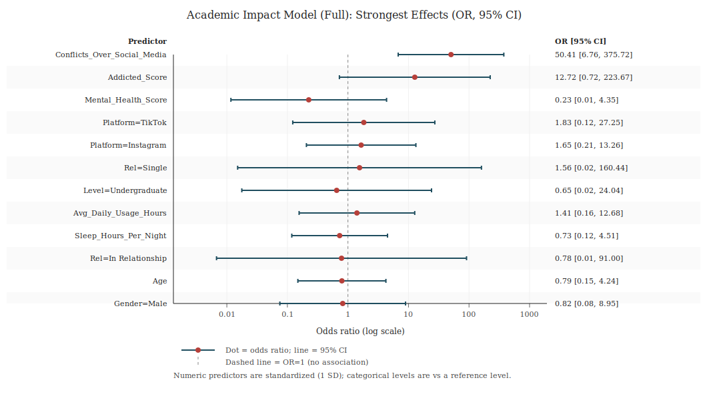
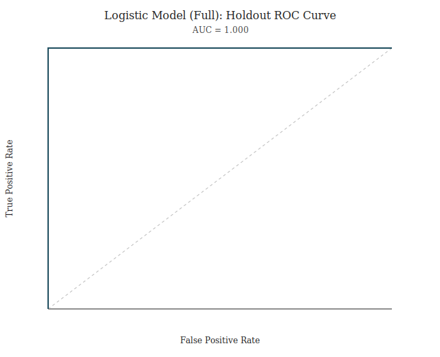
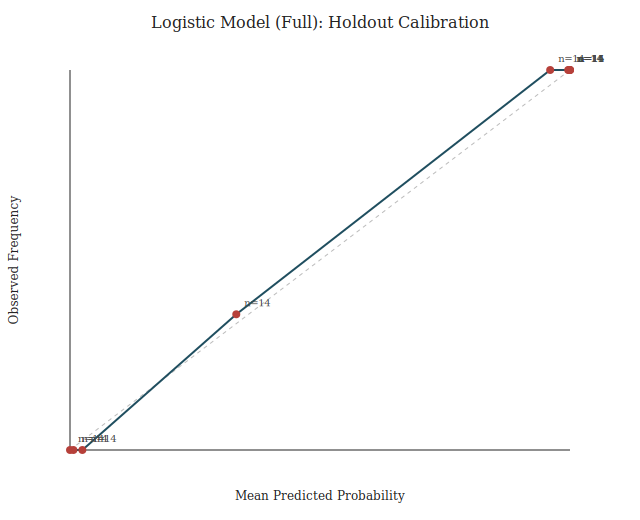

# Academic Impact Analysis (CI, Chi-square, Logistic Regression)

## Sample
- Rows analyzed: 705
- Academic impact: Yes=453 (0.643), No=252 (0.357)
- 95% CI for proportion Yes (Wilson): [0.606, 0.677]

## Numeric comparisons (Yes vs No)
Outputs: `numeric_group_comparisons.csv` (mean difference CI + Cohen’s d).

## Categorical associations (chi-square independence tests)
Summary: `categorical_chi_square_summary.csv` (includes Cramér’s V).

### Gender
- Chi-square=0.43, df=1, p=0.5113, Cramér’s V=0.025, min expected=125.82

### Academic_Level
- Chi-square=10.79, df=2, p=0.0045, Cramér’s V=0.124, min expected=9.65

### Relationship_Status
- Chi-square=22.71, df=2, p=<1e-4, Cramér’s V=0.179, min expected=11.44

### Most_Used_Platform
- Chi-square=209.43, df=6, p=<1e-4, Cramér’s V=0.545, min expected=7.51

## Logistic regression (binary outcome)
Coefficient tables (odds ratios + 95% CI):
- `logistic_full_odds_ratios.csv`
- `logistic_usage_only_odds_ratios.csv`
- `logistic_addiction_only_odds_ratios.csv`

### Model evaluation (holdout + cross-validation)
- Split: train=564, test=141 (test_frac=0.20, seed=42)
| Model | Train AUC | Test AUC | Train Acc@0.5 | Test Acc@0.5 | CV AUC (mean±sd) | CV Acc@0.5 (mean±sd) |
|---|---:|---:|---:|---:|---:|---:|
| full | 1.000 | 1.000 | 1.000 | 1.000 | 1.000±0.000 | 1.000±0.000 |
| usage_only | 1.000 | 1.000 | 1.000 | 1.000 | 1.000±0.000 | 0.997±0.004 |
| addiction_only | 1.000 | 1.000 | 1.000 | 1.000 | 1.000±0.000 | 1.000±0.000 |

### Model metrics (in-sample)
| Model | Converged | Iter | LogLik | AUC | Acc@0.5 | TP | FP | TN | FN |
|---|---:|---:|---:|---:|---:|---:|---:|---:|---:|
| full | True | 10 | -8.6 | 1.000 | 1.000 | 453 | 0 | 252 | 0 |
| usage_only | True | 10 | -12.2 | 1.000 | 1.000 | 453 | 0 | 252 | 0 |
| addiction_only | True | 10 | -8.5 | 1.000 | 1.000 | 453 | 0 | 252 | 0 |

### Forest plot (largest effects in full model)

### Holdout diagnostics (full model)

### Modeling caution
- The in-sample evaluation achieves perfect classification (FP=0 and FN=0).
- The holdout evaluation achieves perfect classification (FP=0 and FN=0).
- This often indicates (near-)complete separation in synthetic/survey-like data; odds ratios/SEs can become unstable.
- If needed, rerun with ridge regularization, e.g. `python3 academic_impact_analysis.py --l2 1.0`.

## Interpretation notes
- Observational survey data: interpret as association, not causation.
- Usage and addiction can be highly correlated; compare `full` vs single-predictor models to assess sensitivity.
