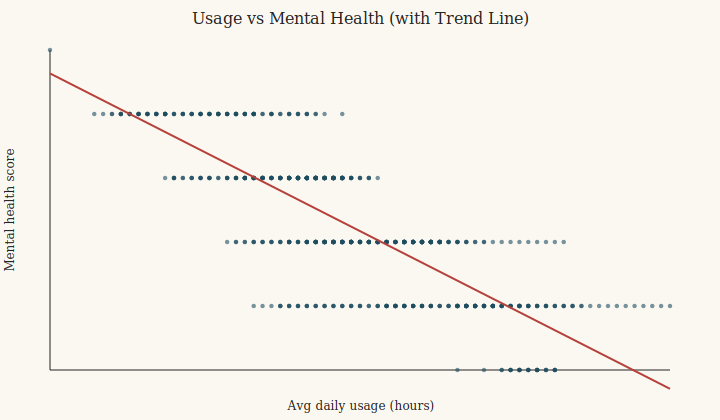
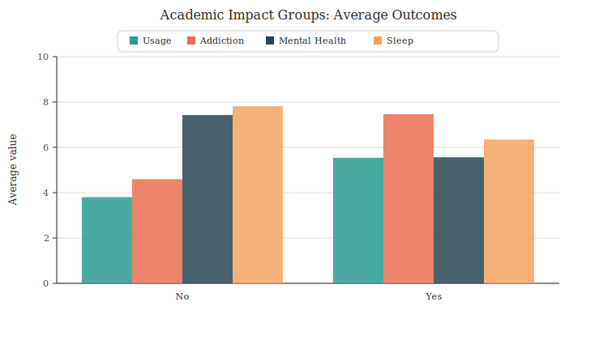

# Data-Driven Question Proposal

## One research question
How does social media addiction mediate the link between daily usage intensity and negative outcomes (mental health, sleep quality, and relationship conflicts), and does this mechanism explain why some students report academic performance being affected?

## Why this question fits the dataset
- The strongest associations in the dataset are between addiction score and mental health, sleep hours, and relationship conflicts.
- Academic impact (Yes/No) cleanly separates the sample with large differences in usage, addiction, mental health, and sleep.
- The dataset contains all variables needed for regression, mediation, and group comparison analyses.

## Key evidence from the data
- Addiction correlates strongly with mental health, sleep, and conflicts.
- Usage intensity also correlates strongly with those outcomes.
- Students reporting academic impact show higher usage and addiction and worse sleep/mental health.

## Figures

### 1) Usage vs mental health

### 2) Addiction by academic level

### 3) Academic impact groups (Yes vs No)

## Suggested analysis path
- Correlation matrix and partial correlations controlling for age, gender, and academic level.
- Regression: outcomes ~ usage + addiction + controls.
- Mediation: usage -> addiction -> outcomes.
- Group differences: academic impact Yes vs No with effect sizes.

This table shows that high school students differ from undergraduates and graduates by large, practically meaningful margins across usage, addiction, sleep, mental health, and conflict — with effects often exceeding one standard deviation.